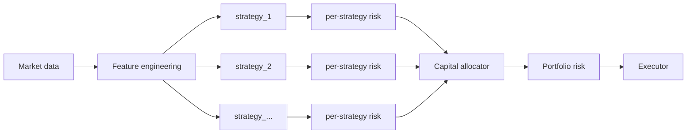

# Jarvis Quant Framework

A regime-aware, **multi-strategy** trading research framework: an HMM regime
brain, a parallel strategy registry, a capital allocator, and an asymmetric risk
matrix with absolute veto power — wired for honest walk-forward backtesting and a
dry-run live dashboard.

> **Safety first.** The framework never defaults to live trading (it refuses to
> start without an explicit dry-run/broker), every order requires a mandatory ATR
> stop, and the risk layers can only ever *tighten* exposure. See `01_CLAUDE.md`.

---

## Architecture



Pipeline: **data → features → [strategy_1, strategy_2, …] → allocator →
portfolio_risk → executor**. Each strategy's signal passes its own risk manager,
then the portfolio-wide risk manager; both hold absolute veto power.

| Layer | Module |
|---|---|
| Regime brain (HMM, forward-only) | `core/hmm_engine.py` |
| Strategies + registry | `core/regime_strategies.py`, `core/strategy_registry.py`, `core/registered_strategies.py` |
| Capital allocator | `core/capital_allocator.py` |
| Risk matrix (per-strategy + portfolio) | `core/risk_manager.py` |
| Walk-forward + multi-strat backtest | `backtest/backtester.py`, `backtest/multistrat.py` |
| Live orchestration (dry-run) | `execution/multistrat_engine.py` |
| Monitoring (logs, dashboard, alerts) | `monitoring/` |
| Configuration | `config/settings.yaml` |

---

## Quick start

```powershell
# 1. install deps into the project venv
.\.venv\Scripts\python.exe -m pip install -r requirements.txt   # or your env of choice

# 2. single-strategy walk-forward backtest
python main.py backtest --symbols SPY --start 2018-01-01 --end 2024-12-31 --compare

# 3. live monitoring dashboard (simulated feed, NO real orders)
python main.py live --dry-run

# 4. run the test suite
python -m pytest tests/ -q
```

---

## Multi-Strategy Mode

Run several strategies together, let the allocator split capital between them,
and enforce portfolio-wide risk on top. Full guide: [docs/multistrat.md](docs/multistrat.md).

### Backtest all enabled strategies together

```powershell
python main.py backtest --multi-strat --start 2018-01-01 --end 2024-12-31 --compare
```

Reports portfolio **and** per-strategy metrics, a correlation report, benchmark
comparisons (equal-weight / best-single / worst-single / buy-hold), and answers
the guiding question: *does the multi-strat portfolio have a better Calmar than
the best single strategy?* Outputs land in `logs/multistrat/`.

### Live dry-run with the full risk stack

```powershell
python main.py live --dry-run --multi-strat
# optional overrides:
#   --strategies hmm_regime,momentum_breakout   enable a specific set
#   --allocator equal_weight                    override the allocator approach
#   --no-portfolio-risk                         DEBUG ONLY — never in production
```

The dashboard adds a `MULTI-STRAT ALLOCATIONS` panel (per-strategy weight,
Sharpe, health) and fires alerts for auto-disable, rebalance, correlation
clusters, and portfolio drawdown breakers.

### Enable a second strategy (30 seconds)

Everything is config-driven — no code change to activate a registered strategy.
In `config/settings.yaml`:

```yaml
strategies:
  hmm_regime:
    enabled: true
    symbols: [SPY, QQQ]
    weight_min: 0.10
    weight_max: 0.50
  momentum_breakout:
    enabled: true          # <-- flip to true to add it to the portfolio
    symbols: [AAPL, NVDA, TSLA]
    weight_min: 0.05
    weight_max: 0.30
```

Then re-run any multi-strat command above. To write a brand-new strategy, see the
5-minute walkthrough in [docs/multistrat.md](docs/multistrat.md#how-to-add-a-new-strategy-5-minute-walkthrough).

---

## Allocator approaches

`equal_weight` · `inverse_vol` (default) · `risk_parity` · `performance_weighted`,
each layered with correlation-merge, per-strategy weight constraints, a cash
reserve, and a portfolio drawdown kill switch. Comparison table and pitfalls in
[docs/multistrat.md](docs/multistrat.md#allocator-approaches-compared).

---

## Testing

```powershell
python -m pytest tests/ -q
```

Key multi-strategy suites:

- `tests/test_multistrat_backtest.py` — allocation math, correlation report, health disabling.
- `tests/test_multistrat_integration.py` — live engine: per-strategy → portfolio risk → executor.
- `tests/test_multistrat_e2e.py` — correlated merge, diversification Sharpe, failure redistribution, 80% cap.
- `tests/test_look_ahead.py` — guards the forward-only (no look-ahead) contract.
